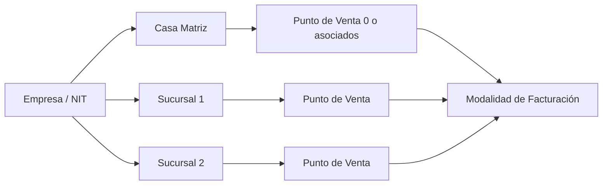
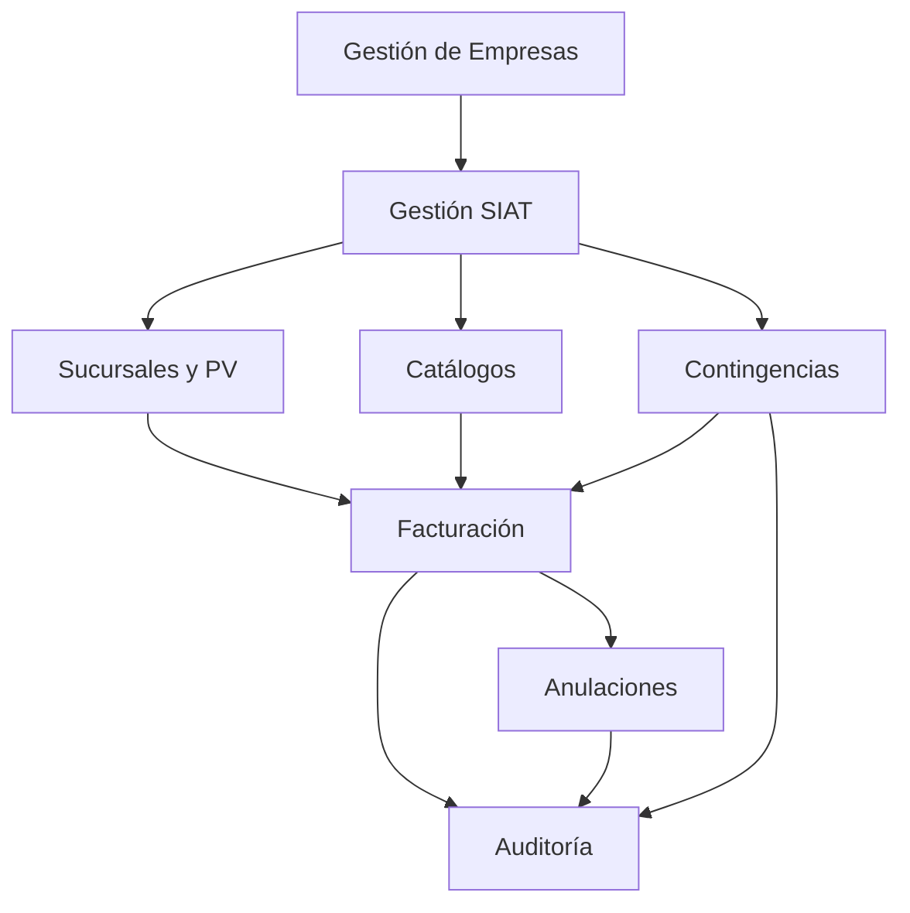

A continuación te entrego un **Manual de Investigación e Integración del SIAT para Supay**, orientado a arquitectura, análisis funcional y preparación normativa. Está basado en fuentes oficiales del SIN/SIAT consultadas recientemente y enfocado en una implementación futura, **sin código**. [siatinfo.impuestos.gob](https://siatinfo.impuestos.gob.bo/index.php/sistema-facturacion)

# Manual SIAT para Supay

**Fecha de actualización de la investigación:** 2026-08-04.  
**Alcance:** facturación electrónica boliviana en línea, modalidades vigentes, contingencias, catálogos, firma digital, sucursales/puntos de venta, auditoría y preparación para homologación. [siatinfo.impuestos.gob](https://siatinfo.impuestos.gob.bo/index.php/sistema-facturacion)

## Índice

1. Marco general del SIAT  
2. Requisitos para operar un sistema de facturación  
3. Conceptos tributarios clave  
4. Sucursales y puntos de venta  
5. Flujo completo de emisión de factura  
6. Catálogos a sincronizar  
7. Firma digital y certificados  
8. Anulación de facturas  
9. Contingencias y facturación offline  
10. Almacenamiento y auditoría  
11. Arquitectura funcional recomendada para Supay  
12. Riesgos y desafíos de integración  
13. Checklist funcional para Supay  
14. Glosario SIAT  
15. Referencias oficiales

## 1) Marco general del SIAT

El SIAT es la plataforma del SIN para administrar trámites, facturación, registros y servicios vinculados al cumplimiento tributario. En facturación, el ecosistema actual combina modalidades en línea y modalidades tradicionales/mixtas aún vigentes según el tipo de contribuyente y la asignación normativa. [siatinfo.impuestos.gob](https://siatinfo.impuestos.gob.bo/index.php/sistema-facturacion)

### Modalidades vigentes y diferencias

| Modalidad | Cómo opera | Firma/credencial | Quién la usa típicamente |
|---|---|---|---|
| Facturación Electrónica en Línea | El sistema genera la factura digital, la firma y la envía a validación del SIN. | Firma digital + token propio o delegado. | Contribuyentes con sistema autorizado en línea, especialmente empresas con mayor automatización.  [siatinfo.impuestos.gob](https://siatinfo.impuestos.gob.bo/index.php/informacion/modalidades-facturacion/facturacion-electronica) |
| Facturación Computarizada en Línea | El sistema genera XML y envía a validación; la autenticidad se apoya en huella del XML y token. | Token de acceso + huella del XML. | Sistemas computarizados autorizados que operan en línea.  [siatinfo.impuestos.gob](https://siatinfo.impuestos.gob.bo/index.php/facturacion-en-linea/factura-electronica) |
| Portal Web en Línea | El SIN provee una interfaz web para emisión. | Credenciales de acceso del SIN. | Contribuyentes con menor volumen o sin sistema propio.  [siatinfo.impuestos.gob](https://siatinfo.impuestos.gob.bo/index.php/facturacion-en-linea/factura-electronica) |
| Manual / Prevalorada / Computarizada tradicional | Modalidades no equivalentes a la emisión electrónica en línea; siguen reglas específicas. | Según modalidad. | Casos específicos no migrados a línea o bajo contingencia/normativa previa.  [siatinfo.impuestos.gob](https://siatinfo.impuestos.gob.bo/index.php/sistema-facturacion) |

### Observación práctica para Supay
Supay debe diseñarse como **motor de integración multiempresa** capaz de adaptarse a al menos dos modos de emisión en línea: **electrónica** y **computarizada**, además de contemplar los flujos de contingencia y transcripción de manuales cuando aplique. [siatinfo.impuestos.gob](https://siatinfo.impuestos.gob.bo/index.php/facturacion-en-linea/factura-electronica)

## 2) Requisitos para operar un sistema

Para operar en facturación en línea, el contribuyente debe contar con sistema autorizado, conectividad, y según modalidad, firma digital o credenciales del SIN. La solicitud de autorización exige que el NIT esté activo y que existan obligaciones tributarias aplicables, además de los parámetros del sistema y documentos sectoriales. [siatanexo.impuestos.gob](https://siatanexo.impuestos.gob.bo/index.php/informacion-gral/requisitos-sfvl)

### Relación NIT, Código de Sistema, sucursal y punto de venta

- **NIT** identifica al contribuyente.
- **Código de Sistema** identifica el sistema autorizado.
- **Sucursal** identifica el establecimiento físico o casa matriz.
- **Punto de Venta** identifica un canal/lugar/dispositivo asociado a una sucursal o matriz para emitir facturas. [siatinfo.impuestos.gob](https://siatinfo.impuestos.gob.bo/index.php/facturacion-en-linea/requerimientos/sucursales-y-puntos-de-venta)

En CUIS, la administración tributaria relaciona sistema, credenciales, contribuyente, sucursal y eventualmente punto de venta; el CUIS tiene vigencia anual. [siatinfo.impuestos.gob](https://siatinfo.impuestos.gob.bo/index.php/informacion/codigos-de-autorizacion)

### Ambientes de prueba y producción

El SIN describe procesos de autorización con fase piloto/pruebas y acceso a producción mediante SIAT en Línea. Para homologación, se exigen pruebas funcionales, incluida generación y envío de paquetes de contingencia, según el tipo de documento sector asociado. [siatinfo.impuestos.gob](https://siatinfo.impuestos.gob.bo/index.php/facturacion-en-linea/autorizacion-de-sistemas/proceso-de-autorizacion)

### Requisitos de homologación públicamente conocidos

- Autorización del sistema.
- Pruebas de emisión y recepción.
- Pruebas de contingencia y paquetes.
- Pruebas por documentos sectoriales.
- Consistencia con catálogos y estructuras XML publicadas. [siatinfo.impuestos.gob](https://siatinfo.impuestos.gob.bo/index.php/sistema-facturacion)

## 3) Conceptos tributarios clave

| Concepto | Para qué sirve | Cuándo se usa | Relación con otros elementos |
|---|---|---|---|
| CUIS | Habilita el inicio de uso del sistema para una combinación de contribuyente, sucursal y opcionalmente punto de venta. | Al iniciar operación y renovaciones según vigencia. | Precede al CUFD; habilita la operación del sistema.  [siatinfo.impuestos.gob](https://siatinfo.impuestos.gob.bo/index.php/informacion/codigos-de-autorizacion) |
| CUFD | Habilita la emisión diaria de facturas digitales por 24 horas. | Diariamente, o durante contingencia según reglas de vigencia extendida. | Se usa para generar CUF y emitir facturas.  [siatinfo.impuestos.gob](https://siatinfo.impuestos.gob.bo/index.php/informacion/codigos-de-autorizacion) |
| CUF | Identificador único de la factura. | En cada factura emitida. | Nace en el sistema al emitir la factura.  [siatinfo.impuestos.gob](https://siatinfo.impuestos.gob.bo/index.php/informacion/codigos-de-autorizacion) |
| Código de Control | Identificador propio de facturas manuales/tradicionales en ciertos esquemas. | En modalidades que lo requieran. | No sustituye CUF; aplica a documentos manuales/preimpresos.  [siatinfo.impuestos.gob](https://siatinfo.impuestos.gob.bo/index.php/sistema-facturacion) |
| Evento significativo | Registro formal de una contingencia o hecho que afecta la emisión. | Al iniciar/finalizar contingencias o hechos relevantes. | Justifica emisión fuera de línea y envío posterior.  [siatinfo.impuestos.gob](https://siatinfo.impuestos.gob.bo/index.php/facturacion-en-linea/emision-y-envio-de-facturas/contingencia-y-eventos-significativos) |
| Contingencia | Situación que impide o degrada la emisión normal. | Corte de Internet, energía, fallas de software/hardware, inaccesibilidad SIAT. | Dispara emisión offline o manual según el caso.  [siatinfo.impuestos.gob](https://siatinfo.impuestos.gob.bo/index.php/facturacion-en-linea/emision-y-envio-de-facturas/contingencia-y-eventos-significativos) |
| Paquete de facturas | Conjunto de facturas emitidas offline que se envían luego al SIN. | Al recuperar la conectividad/normalidad. | Debe enviarse y validarse posteriormente.  [siatinfo.impuestos.gob](https://siatinfo.impuestos.gob.bo/index.php/facturacion-en-linea/casos-especiales/manuales-contingencia) |
| Catálogos sincronizados | Datos maestros oficiales del SIN. | Antes de emitir y de forma periódica. | Alimentan validación y construcción de la factura.  [siatinfo.impuestos.gob](https://siatinfo.impuestos.gob.bo/index.php/facturacion-en-linea/emision-y-envio-de-facturas/emision-y-envio) |
| Leyendas fiscales | Textos obligatorios según tipo de documento/operación. | En impresión y representación gráfica. | Deben reflejar el régimen y el tipo de comprobante.  [siatinfo.impuestos.gob](https://siatinfo.impuestos.gob.bo/index.php/facturacion-manual/titulos-y-subtitulos) |
| QR tributario | Código de verificación en representación gráfica. | En la factura impresa/PDF. | Resume datos para verificación y trazabilidad.  [siatinfo.impuestos.gob](https://siatinfo.impuestos.gob.bo/index.php/sistema-facturacion) |

## 4) Sucursales y puntos de venta

Las sucursales son establecimientos secundarios registrados en el padrón; en facturación, la emisión se organiza por casa matriz o sucursal. Los puntos de venta no están en el padrón, pero deben registrarse en el sistema antes de usarse. [siatinfo.impuestos.gob](https://siatinfo.impuestos.gob.bo/index.php/facturacion-en-linea/requerimientos/sucursales-y-puntos-de-venta)

### Operaciones administrativas

- **Alta:** registro inicial en el SIAT o en servicios web.
- **Consulta:** verificación de estado, vigencia y asociación.
- **Modificación:** ajustes permitidos por normativa.
- **Cierre:** baja operativa o cierre administrativo del punto/sucursal según reglas del SIN. [siatinfo.impuestos.gob](https://siatinfo.impuestos.gob.bo/index.php/facturacion-en-linea/requerimientos/sucursales-y-puntos-de-venta)

### Validaciones relevantes

- Un punto de venta siempre debe estar asociado a una sucursal o casa matriz.
- La numeración y el alcance operativo dependen de la combinación NIT + sucursal + punto de venta.
- En despliegue centralizado, la sincronización puede ejecutarse una vez por casa matriz; en descentralizado, por sucursal/punto de venta. [siatinfo.impuestos.gob](https://siatinfo.impuestos.gob.bo/index.php/facturacion-en-linea/requerimientos/sucursales-y-puntos-de-venta)

### Diagrama conceptual

## 5) Flujo completo de emisión

1. **Sincronizar catálogos** necesarios para el tipo de documento sector. [siatinfo.impuestos.gob](https://siatinfo.impuestos.gob.bo/index.php/facturacion-en-linea/emision-y-envio-de-facturas/emision-y-envio)
2. **Obtener CUIS** para iniciar uso del sistema para la combinación contribuyente/sucursal/punto de venta. [siatinfo.impuestos.gob](https://siatinfo.impuestos.gob.bo/index.php/facturacion-en-linea/implementacion-servicios-facturacion/codigos/solicitud-cufd)
3. **Obtener CUFD** vigente del día o del tramo autorizado. [siatinfo.impuestos.gob](https://siatinfo.impuestos.gob.bo/index.php/facturacion-en-linea/implementacion-servicios-facturacion/codigos/solicitud-cufd)
4. **Construir el XML** con datos de emisor, receptor, detalle, totales, leyendas y QR tributario. [siatinfo.impuestos.gob](https://siatinfo.impuestos.gob.bo/index.php/sistema-facturacion)
5. **Firmar digitalmente** cuando la modalidad lo exija. [siatinfo.impuestos.gob](https://siatinfo.impuestos.gob.bo/index.php/informacion/modalidades-facturacion/facturacion-electronica)
6. **Enviar al SIAT/SIN** mediante el servicio correspondiente. [siatinfo.impuestos.gob](https://siatinfo.impuestos.gob.bo/index.php/informacion/modalidades-facturacion/facturacion-electronica)
7. **Recibir validación** y registrar el estado de recepción/autorización/observación. [siatinfo.impuestos.gob](https://siatinfo.impuestos.gob.bo/index.php/facturacion-en-linea/casos-especiales/manuales-contingencia)
8. **Generar representación gráfica** en PDF u otro formato visual con QR y leyendas. [siatinfo.impuestos.gob](https://siatinfo.impuestos.gob.bo/index.php/sistema-facturacion)
9. **Almacenar y auditar** XML, respuesta, CUFD, CUIS, logs y evidencia de entrega. [siatinfo.impuestos.gob](https://siatinfo.impuestos.gob.bo/index.php/facturacion-en-linea/emision-y-envio-de-facturas/contingencia-y-eventos-significativos)

## 6) Catálogos a sincronizar

El SIN publica catálogos que deben mantenerse actualizados, especialmente para actividades, productos/servicios, unidades, documentos de identidad, medios de pago, monedas, tipos de factura, eventos significativos y otros parámetros sectoriales. La sincronización diaria es la recomendación operativa que aparece en la documentación del SIN. [siatinfo.impuestos.gob](https://siatinfo.impuestos.gob.bo/images/archivos_tecnicos/archivos_apoyo/catalogos_facturacion_electronica.xlsx)

| Catálogo | Frecuencia | Cuándo sincronizar | Impacto en Supay |
|---|---|---|---|
| Actividades económicas | Variable, verificar diariamente. | Antes de emitir y al actualizar padrón/operación. | Determina documentos sector y reglas aplicables.  [siatinfo.impuestos.gob](https://siatinfo.impuestos.gob.bo/index.php/facturacion-en-linea/emision-y-envio-de-facturas/emision-y-envio) |
| Productos y servicios | Variable. | Antes de emitir y ante cambios de catálogos. | Impacta detalle de factura y validaciones.  [siatinfo.impuestos.gob](https://siatinfo.impuestos.gob.bo/index.php/facturacion-en-linea/emision-y-envio-de-facturas/emision-y-envio) |
| Unidades de medida | Variable. | Al sincronizar catálogos generales. | Afecta cantidades y totales. |
| Tipos de documento de identidad | Variable. | Al sincronizar catálogo maestro. | Receptor y validación fiscal. |
| Métodos de pago | Variable. | Antes de operación y cambios normativos. | Forma de cobro y registro. |
| Monedas | Variable. | Antes de operación multi-moneda. | Cálculos y redondeos. |
| Tipos de factura | Poco frecuente. | Cuando cambie el marco normativo. | Define plantilla y reglas. |
| Mensajes de servicio | Variable. | Consulta periódica. | Información para el usuario final. |
| Eventos significativos | Pueden cambiar. | Al configurar contingencia/operación. | Gestión de fallos y legalidad.  [siatinfo.impuestos.gob](https://siatinfo.impuestos.gob.bo/images/archivos_tecnicos/archivos_apoyo/catalogos_facturacion_electronica.xlsx) |
| Documentos sector | Variable. | Al autorizar y al emitir. | Define estructura XML y validaciones.  [siatinfo.impuestos.gob](https://siatinfo.impuestos.gob.bo/index.php/facturacion-en-linea/requerimientos/sistema-informatico?id=66) |

## 7) Firma digital y certificados

El SIN indica que para facturación electrónica en línea se requiere firma digital; para obtener un certificado válido se mencionan entidades certificadoras autorizadas en Bolivia como **ADSIB** y **Digicert SRL**. [siatinfo.impuestos.gob](https://siatinfo.impuestos.gob.bo/index.php/facturacion-en-linea/firma-digital/firma-digital)

### Formato y seguridad

La documentación pública del SIN habla de CSR, certificados públicos firmados por la entidad certificadora, y uso de claves vinculadas al titular. Conceptualmente, Supay debe tratar el certificado como un activo sensible: almacenamiento seguro, control de acceso, trazabilidad y rotación planificada. [siatinfo.impuestos.gob](https://siatinfo.impuestos.gob.bo/index.php/facturacion-en-linea/firma-digital/generacion-csr/introduccion-a-csr)

### Recomendación funcional
Supay debería separar la gestión del certificado del motor de emisión, permitiendo:
- carga segura del certificado;
- expiración y renovación anticipada;
- alertas de vigencia;
- segregación por empresa/entidad legal.  

## 8) Anulación de facturas

La anulación debe preservarse como operación fiscal sensible, con motivo válido, trazabilidad y conservación del XML original, estado de envío y respuesta del SIAT. En las guías de contingencia y consultas del SIN se observa que la anulación puede depender de si la factura ya fue registrada en servidores del SIN. [siatinfo.impuestos.gob](https://siatinfo.impuestos.gob.bo/index.php/facturacion-en-linea/emision-y-envio-de-facturas/contingencia-y-eventos-significativos)

### Qué debe conservar Supay
- Identificador de factura anulada.
- Motivo de anulación.
- Usuario, fecha, hora y rol.
- Estado previo y posterior.
- Evidencia de aceptación/rechazo del SIAT si aplica.
- Relación con notas o documentos de respaldo.  

## 9) Contingencias y facturación offline

Este es uno de los aspectos más críticos. El SIN reconoce contingencias como corte de Internet, corte de energía, fallas de software/hardware, problemas de comunicación e inaccesibilidad al servicio web, entre otros eventos significativos codificados. [siatinfo.impuestos.gob](https://siatinfo.impuestos.gob.bo/index.php/facturacion-en-linea/emision-y-envio-de-facturas/contingencia-y-eventos-significativos)

### Flujo cronológico recomendado

1. Detectar degradación o caída.
2. Registrar el evento significativo correspondiente.
3. Cambiar a emisión fuera de línea o manual según el caso.
4. Emitir usando el último CUFD válido; si la caída es del servicio de CUFD, la vigencia puede ampliarse hasta 72 horas según la guía pública del SIN. [siatinfo.impuestos.gob](https://siatinfo.impuestos.gob.bo/index.php/facturacion-en-linea/emision-y-envio-de-facturas/ingreso-a-contingencia)
5. Almacenar las facturas en paquetes.
6. Al restablecer el servicio, obtener nuevo CUFD.
7. Transcribir facturas manuales si correspondía.
8. Enviar paquetes al SIN.
9. Validar recepción del paquete.
10. Registrar cierre de contingencia. [siatinfo.impuestos.gob](https://siatinfo.impuestos.gob.bo/index.php/facturacion-en-linea/casos-especiales/manuales-contingencia)

### Restricciones públicas relevantes
- Los eventos significativos deben registrarse hasta 48 horas después de finalizada la contingencia. [siatinfo.impuestos.gob](https://siatinfo.impuestos.gob.bo/index.php/facturacion-en-linea/emision-y-envio-de-facturas/contingencia-y-eventos-significativos)
- Los paquetes pueden tener hasta 500 facturas y deben ser del mismo documento sector. [siatinfo.impuestos.gob](https://siatinfo.impuestos.gob.bo/index.php/facturacion-en-linea/casos-especiales/manuales-contingencia)
- Se usa compresión Gzip y hash SHA-256 del archivo comprimido para el envío del paquete. [siatinfo.impuestos.gob](https://siatinfo.impuestos.gob.bo/index.php/facturacion-en-linea/casos-especiales/manuales-contingencia)

## 10) Almacenamiento y auditoría

Supay debe conservar evidencia completa de la vida fiscal del documento: XML emitidos y recibidos, respuestas del SIN, CUFD históricos, logs, representación gráfica, anulaciones y contingencias. La documentación pública del SIN enfatiza la trazabilidad de eventos, paquetes y validación posterior. [siatinfo.impuestos.gob](https://siatinfo.impuestos.gob.bo/index.php/facturacion-en-linea/emision-y-envio-de-facturas/contingencia-y-eventos-significativos)

### Conservación recomendada
La norma pública consultada no siempre explicita en la misma página el plazo de conservación documental; por eso Supay debería diseñarse para conservar todo el histórico fiscal por periodos alineados con la normativa tributaria local aplicable y con políticas conservadoras de largo plazo. Esto debe validarse con asesoría legal tributaria antes de cierre de diseño. [siatinfo.impuestos.gob](https://siatinfo.impuestos.gob.bo/index.php/sistema-facturacion)

## 11) Arquitectura funcional recomendada

### Módulos
- **Gestión de empresas:** NIT, razón social, obligaciones, certificados, configuración legal.
- **Gestión tributaria SIAT:** CUIS, CUFD, eventos, autorizaciones, tokens, estado de servicios.
- **Sucursales y puntos de venta:** alta, cierre, asociación y vigencia.
- **Catálogos:** sincronización, versionado, cache y validación.
- **Facturación:** armado de XML, firma, envío, recepción, PDF/QR.
- **Anulaciones:** motivos, flujo de aprobación, trazabilidad.
- **Contingencias:** detección, operación offline, paquetes, regularización.
- **Auditoría:** logs, evidencia, estados, trazabilidad legal.
- **Reportes fiscales:** monitoreo operativo y soporte a cumplimiento.

### Comunicación conceptual

## 12) Riesgos y desafíos

- El ecosistema SOAP del SIAT puede ser complejo y sensible a versiones. [siatinfo.impuestos.gob](https://siatinfo.impuestos.gob.bo/index.php/facturacion-en-linea/factura-electronica?id=750)
- La operación depende de CUFD vigentes y de su renovación diaria o en contingencia. [siatinfo.impuestos.gob](https://siatinfo.impuestos.gob.bo/index.php/facturacion-en-linea/implementacion-servicios-facturacion/codigos/solicitud-cufd)
- La sincronización de catálogos es una fuente frecuente de errores si se omite o se hace tardíamente. [siatinfo.impuestos.gob](https://siatinfo.impuestos.gob.bo/index.php/facturacion-en-linea/emision-y-envio-de-facturas/emision-y-envio)
- El manejo de errores del SIN exige reintentos, monitoreo y reglas de fallback. [siatinfo.impuestos.gob](https://siatinfo.impuestos.gob.bo/index.php/facturacion-en-linea/emision-y-envio-de-facturas/ingreso-a-contingencia)
- La disponibilidad del servicio no puede asumirse como continua; debe existir plan de contingencia. [siatinfo.impuestos.gob](https://siatinfo.impuestos.gob.bo/index.php/facturacion-en-linea/emision-y-envio-de-facturas/contingencia-y-eventos-significativos)
- En SaaS multiempresa, cada cliente puede tener distinta modalidad, sucursal, punto de venta, certificado y calendario de operación.

## 13) Checklist funcional

- Empresa con NIT activo y configuración fiscal completa.
- Código de Sistema autorizado.
- Certificado/firma digital configurada.
- Sucursales registradas.
- Puntos de venta registrados.
- Catálogos sincronizados.
- CUIS vigente.
- CUFD vigente.
- Factura emitida con XML válido.
- Validación del SIN recibida.
- PDF/representación gráfica generada.
- Auditoría almacenada.
- Flujo de anulación disponible.
- Modo contingencia operativo.
- Paquetes offline generados, enviados y validados.
- Evidencia histórica exportable para auditoría.  

## Glosario breve

- **SIN:** Servicio de Impuestos Nacionales.
- **SIAT:** Sistema Integrado de la Administración Tributaria.
- **CUIS:** código único de inicio de sistemas.
- **CUFD:** código único de facturación diaria.
- **CUF:** código único de factura.
- **PV:** punto de venta.
- **CSR:** solicitud de firma/certificado.
- **XML:** representación estructurada de la factura.
- **Evento significativo:** registro legal de contingencia o hecho relevante.
- **Paquete de facturas:** lote offline para envío posterior. [siatinfo.impuestos.gob](https://siatinfo.impuestos.gob.bo/index.php/facturacion-en-linea/emision-y-envio-de-facturas/contingencia-y-eventos-significativos)

## Referencias oficiales

- [Facturación Electrónica – SIAT](https://siatinfo.impuestos.gob.bo/index.php/informacion/modalidades-facturacion/facturacion-electronica) [siatinfo.impuestos.gob](https://siatinfo.impuestos.gob.bo/index.php/informacion/modalidades-facturacion/facturacion-electronica)
- [Facturación – SIAT](https://siatinfo.impuestos.gob.bo/index.php/sistema-facturacion) [siatinfo.impuestos.gob](https://siatinfo.impuestos.gob.bo/index.php/sistema-facturacion)
- [Facturación en línea – Consideraciones](https://siatinfo.impuestos.gob.bo/index.php/facturacion-en-linea/factura-electronica?id=750) [siatinfo.impuestos.gob](https://siatinfo.impuestos.gob.bo/index.php/facturacion-en-linea/factura-electronica?id=750)
- [Códigos de Autorización](https://siatinfo.impuestos.gob.bo/index.php/informacion/codigos-de-autorizacion) [siatinfo.impuestos.gob](https://siatinfo.impuestos.gob.bo/index.php/informacion/codigos-de-autorizacion)
- [Solicitud CUFD](https://siatinfo.impuestos.gob.bo/index.php/facturacion-en-linea/implementacion-servicios-facturacion/codigos/solicitud-cufd) [siatinfo.impuestos.gob](https://siatinfo.impuestos.gob.bo/index.php/facturacion-en-linea/implementacion-servicios-facturacion/codigos/solicitud-cufd)
- [Contingencia y Eventos Significativos](https://siatinfo.impuestos.gob.bo/index.php/facturacion-en-linea/emision-y-envio-de-facturas/contingencia-y-eventos-significativos) [siatinfo.impuestos.gob](https://siatinfo.impuestos.gob.bo/index.php/facturacion-en-linea/emision-y-envio-de-facturas/contingencia-y-eventos-significativos)
- [Facturas Manuales de Contingencia](https://siatinfo.impuestos.gob.bo/index.php/facturacion-en-linea/casos-especiales/manuales-contingencia) [siatinfo.impuestos.gob](https://siatinfo.impuestos.gob.bo/index.php/facturacion-en-linea/casos-especiales/manuales-contingencia)
- [Sucursales y Puntos de Venta](https://siatinfo.impuestos.gob.bo/index.php/facturacion-en-linea/requerimientos/sucursales-y-puntos-de-venta) [siatinfo.impuestos.gob](https://siatinfo.impuestos.gob.bo/index.php/facturacion-en-linea/requerimientos/sucursales-y-puntos-de-venta)
- [Firma Digital](https://siatinfo.impuestos.gob.bo/index.php/facturacion-en-linea/firma-digital/firma-digital) [siatinfo.impuestos.gob](https://siatinfo.impuestos.gob.bo/index.php/facturacion-en-linea/firma-digital/firma-digital)

## Notas de validación adicional

Hay aspectos que requieren contraste directo con el SIN o con asesoría tributaria especializada antes de implementación final:
- plazo exacto de conservación documental;
- reglas finas por sector económico;
- formatos exactos de ciertos catálogos vigentes;
- criterios de homologación que pueden actualizarse;
- diferencias operativas entre versiones SOAP/launcher vigentes. [siatinfo.impuestos.gob](https://siatinfo.impuestos.gob.bo/index.php/sistema-facturacion)

Si quieres, en el siguiente paso puedo convertir esto en un **documento maestro más formal**, con estilo de manual técnico institucional, ampliándolo a una versión larga con:
1. tablas más extensas por cada catálogo,  
2. un diagrama de flujo completo de contingencia,  
3. y una matriz de responsabilidades para Supay.